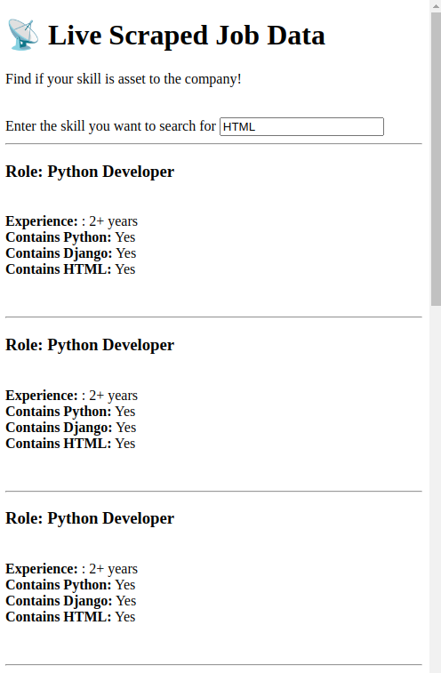

📡 Live Job Scraper Dashboard

A real-time job data dashboard that displays scraped job postings and highlights whether specific skills like Python, Django, or any custom skill entered by the user are mentioned in the job description. Built using Socket.IO, HTML, and JavaScript.

🚀 Features

🔄 Real-time job updates via WebSocket (Socket.IO)

🧠 Skill match detection: Python, Django, and custom skill input

🔎 Custom skill search input

📋 Clean, readable job information display

🧩 Easy integration with any job scraping backend

📸 Screenshot

